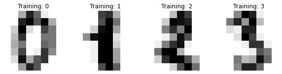
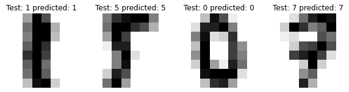

# DNet
Neural Network framework implementation with numpy.

## Installation
Normal user:
```bash
git clone https://github.com/Javicadserres/DNet.git
pip install DNet/.
```

alternatively:
```bash
git clone https://github.com/Javicadserres/DNet.git
pip install DNet/. -r DNet/requirements.txt
```

Developer:
```bash
git clone https://github.com/Javicadserres/DNet.git
pip install -e DNet/. -r DNet/requirements-dev.txt
```

## Tests
To run tests you must install the library as a `developer`.
```bash
cd DNet/
pytest -v tests/
```

## Usage
Import libraries
```python
import numpy as np
import pandas as pd
import matplotlib.pyplot as plt

from sklearn.datasets import load_digits
from sklearn.model_selection import train_test_split
from DNet.model import NNet
from DNet.layers import (
    LinearLayer, 
    ReLU, 
    CrossEntropyLoss, 
    Conv2D,
    MaxPooling2D, 
    AveragePooling2D,
    Flatten
)
from DNet.optimizers import Adam


digits = load_digits()

_, axes = plt.subplots(nrows=1, ncols=4, figsize=(10, 3))
for ax, image, label in zip(axes, digits.images, digits.target):
    ax.set_axis_off()
    ax.imshow(image, cmap=plt.cm.gray_r, interpolation='nearest')
    ax.set_title('Training: %i' % label)
```


Create and train your model.
```python
images = digits.images
m, h, w = images.shape
images = images.reshape(m, 1, h, w)

target = digits.target

def one_hot_encoding(Y):
    """
    One hot enconding method.
    """
    one_hot = np.zeros((Y.size, Y.max() + 1))
    one_hot[np.arange(Y.size), Y] = 1

    return one_hot

x_train, x_test, y_train, y_test = train_test_split(
    images, target, test_size=0.4, random_state=1
)
y_train = one_hot_encoding(y_train)


# Initialize the model
model = NNet()

# Create the model structure
model.add(Conv2D(1, 2, kernel_size=(2, 2), stride=2, padding=1))
model.add(AveragePooling2D(kernel_size=(2, 2), stride=1, padding=1))
model.add(ReLU())

model.add(Conv2D(2, 1, kernel_size=(2, 2), stride=1, padding=0))
model.add(AveragePooling2D(kernel_size=(2, 2), stride=1, padding=0))
model.add(ReLU())

model.add(Flatten())
model.add(LinearLayer(16, 10))

# set the loss functions and the optimize method
loss = CrossEntropyLoss()
optim = Adam(lr=0.05)

# Train the model
costs = []
epochs = 10000

for epoch in range(epochs):
    model.forward(x_train.T)
    cost = model.loss(y_train.T, loss)
    model.backward()
    model.optimize(optim)

    if epoch % 500 == 0:
        print ("Cost after iteration %epoch: %f" %(epoch, cost))
        costs.append(cost)


# plot the loss evolution
costs_ss = pd.Series(costs[1:])

plt.figure(figsize=(7, 3))
plt.plot(costs_ss)
plt.ylabel('cost')
plt.xlabel('iterations (per hundreds)')
plt.title('Loss per epoch')
plt.show()
```


Check test.
```python
_, axes = plt.subplots(nrows=1, ncols=4, figsize=(10, 3))

predictions = model.forward(x_test.T)
predictions = predictions.argmax(axis=0)


for ax, image, label, pred in zip(axes, x_test.reshape((719, 8, 8)), y_test, predictions):
    ax.set_axis_off()
    ax.imshow(image, cmap=plt.cm.gray_r, interpolation='nearest')
    ax.set_title('Test: ' +str(label) + ' predicted: ' + str(pred))
```

